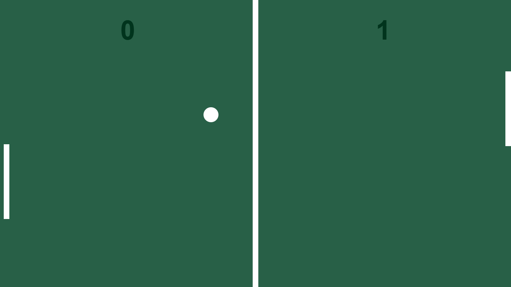

# Jogo de Ping Pong

Este é um jogo de Ping Pong desenvolvido em HTML5, CSS e JavaScript. Ele utiliza o elemento `<canvas>` para renderizar o campo e as animações do jogo, permitindo o controle da raquete esquerda pelo mouse.

## ⚙️ Funcionalidades

- Campo de jogo renderizado com `<canvas>`.
- Controle da raquete esquerda pelo mouse.
- Animação suave da bola e das raquetes.
- Sistema de pontuação entre jogador e computador.
- Aumento progressivo da velocidade da bola e da raquete do computador.

## 🛠️ Tecnologias Utilizadas

- **HTML5**
- **CSS3**
- **JavaScript**

## 🚀 Como Usar

1. Clone este repositório:
   ```bash
   git clone https://github.com/MeirelesRodrigo/PingPong.git
